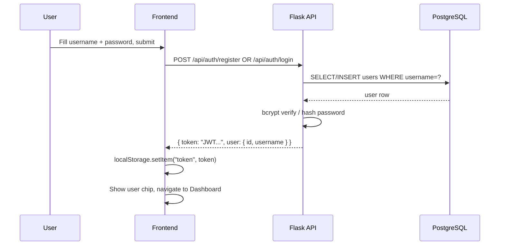
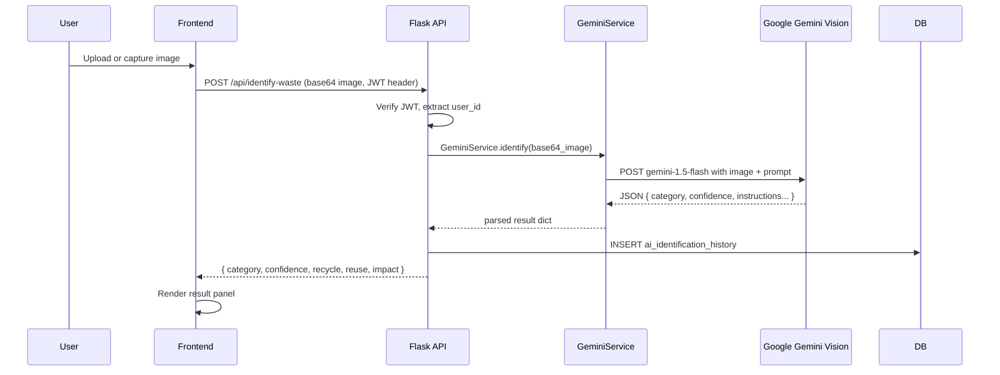
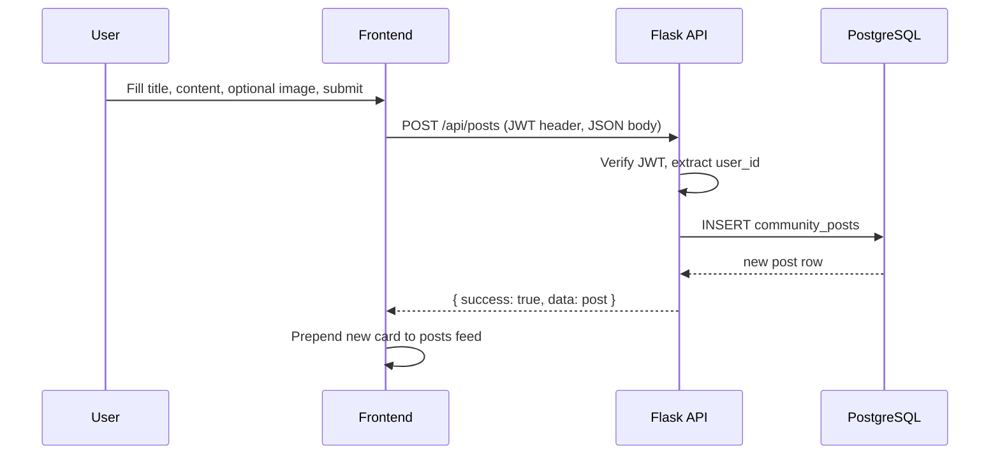

# Design Document: Waste to Wealth Platform

## Overview

ReWorth is a science competition web application that lets users identify waste materials via AI, share community posts about recycling efforts, find and report waste cleanup locations, and access a comprehensive recycling guide. The frontend is a plain HTML/CSS/JS single-page app and the backend is a Flask + PostgreSQL REST API. This design covers the complete integration and extension of both layers: replacing the simulated auth and AI detector with real backend-driven implementations, adding JWT authentication, community posts, waste locations, a dashboard, and a Gemini Vision AI integration — all wrapped in a modern, premium blue/black/purple UI with smooth animations.

The platform must remain framework-free on the frontend (no build step, no bundler) and SQL-first on the backend (psycopg2, no ORM). All new features must integrate cleanly into the existing `index.html` single-page structure by adding new page sections and a multi-page navigation model using JS-controlled section visibility, while keeping the existing hero, about, detector, guide, gallery, why, and contact sections intact.

---

## Architecture

```mermaid
graph TD
    subgraph Frontend["Frontend (Plain HTML/CSS/JS)"]
        LP[Landing Page / index.html]
        AUTH[Auth Modal - Sign In / Sign Up]
        DASH[Dashboard Section]
        DET[AI Detector Section]
        POSTS[Community Posts Section]
        LOCS[Waste Locations Section]
        GUIDE[Recycling Guide Section]
        SIDEBAR[Gemini API Key Sidebar]
        APICLIENT[api.js - Fetch Wrapper + JWT]
    end

    subgraph Backend["Backend (Flask + PostgreSQL)"]
        AUTHAPI[/api/auth/* - Register, Login]
        AIAPI[/api/identify-waste]
        POSTSAPI[/api/posts/*]
        LOCSAPI[/api/locations/*]
        DASHAPI[/api/dashboard]
        KEYMGMT[/api/settings/gemini-key]
        GS[GeminiService class]
        DB[(PostgreSQL)]
    end

    LP --> AUTH
    AUTH --> APICLIENT
    DASH --> APICLIENT
    DET --> APICLIENT
    POSTS --> APICLIENT
    LOCS --> APICLIENT
    SIDEBAR --> APICLIENT

    APICLIENT -->|JWT Bearer| AUTHAPI
    APICLIENT -->|JWT Bearer| AIAPI
    APICLIENT -->|JWT Bearer| POSTSAPI
    APICLIENT -->|JWT Bearer| LOCSAPI
    APICLIENT -->|JWT Bearer| DASHAPI
    APICLIENT -->|JWT Bearer| KEYMGMT

    AUTHAPI --> DB
    POSTSAPI --> DB
    LOCSAPI --> DB
    DASHAPI --> DB
    AIAPI --> GS
    GS -->|Google Gemini Vision API| DB
    KEYMGMT --> DB
```

---

## Sequence Diagrams

### Authentication Flow



### AI Waste Identification Flow



### Community Post Creation Flow



---

## Components and Interfaces

### Component 1: Frontend API Client (`js/api.js` — new file)

**Purpose**: Centralised fetch wrapper that automatically attaches the JWT Authorization header to every protected request, handles 401 responses by clearing the token and redirecting to the sign-in modal, and provides typed helper methods for each backend endpoint.

**Interface**:
```javascript
const API_BASE = "http://localhost:5000";

// Reads token from localStorage
function getToken() → string | null

// Builds headers: Content-Type + optional Bearer token
function buildHeaders(requiresAuth = true) → Headers

// Generic request wrapper
async function request(method, path, body?, requiresAuth?) → { success, data?, message? }

// Auth
async function register(username, password, name) → { token, user }
async function login(username, password) → { token, user }

// AI Detector
async function identifyWaste(base64Image) → { category, confidence, recycle, reuse, impact }
async function updateGeminiKey(apiKey) → { success }

// Community Posts
async function getPosts(page?, limit?) → { data: Post[], total }
async function createPost(title, content, imageBase64?) → Post
async function deletePost(postId) → { success }
async function likePost(postId) → { likes }
async function addComment(postId, text) → Comment

// Waste Locations
async function getLocations() → Location[]
async function createLocation(title, desc, address, imageBase64?) → Location
async function deleteLocation(locationId) → { success }

// Dashboard
async function getDashboard() → DashboardData
```

**Responsibilities**:
- Token lifecycle management (store, read, clear)
- Uniform error handling — surfaces `message` from API body or falls back to HTTP status
- Base64 encoding of File/Blob objects before sending to backend
- Pagination support for posts list

---

### Component 2: Auth Module (extended `js/script.js` auth section)

**Purpose**: Replaces the current client-side-only auth simulation with real API calls. Manages JWT in localStorage, updates the UI between guest and authenticated states, and guards navigation to protected sections.

**Interface**:
```javascript
const Auth = {
  isLoggedIn() → boolean,
  getUser() → { id, username } | null,
  async signIn(username, password) → void,   // calls API.login, stores token
  async signUp(username, password, name) → void,
  signOut() → void,                           // clears localStorage, resets UI
  requireAuth(callback) → void                // shows modal if not logged in
}
```

**Responsibilities**:
- Store `token` and `user` JSON in `localStorage` on login/register
- Restore UI state on page refresh by reading localStorage at init time
- Show/hide auth-dependent nav items (Dashboard link, user chip) vs. guest buttons
- Redirect unauthenticated users who attempt to access protected sections

---

### Component 3: Navigation & Section Router (in `js/script.js`)

**Purpose**: Implements client-side "routing" by showing and hiding named `<section>` elements. The single `index.html` contains all sections; JS toggles `display` and updates the active nav link.

**Interface**:
```javascript
const Router = {
  navigate(sectionId) → void,   // hides all, shows target section
  current() → string            // returns active section id
}
```

**Sections**:
- `#landing` — hero + about + detector + categories + guide + gallery + why + CTA + contact (guest default)
- `#dashboard` — post-login landing
- `#posts` — community posts feed
- `#locations` — waste map / location list
- `#guide-full` — expanded recycling guide

---

### Component 4: Gemini API Key Sidebar (new HTML + JS)

**Purpose**: A slide-in sidebar panel accessible from the AI Detector section and from the nav. Lets the user enter their Google Gemini API key, which is POSTed to the backend and written to the `.env` file / environment, then used by `GeminiService`.

**Interface (HTML)**:
```html
<aside id="geminiSidebar" class="settings-sidebar hidden">
  <h3>Gemini API Key</h3>
  <p>Your key is stored server-side and never exposed in responses.</p>
  <input type="password" id="geminiKeyInput" placeholder="AIzaSy...">
  <button id="saveGeminiKey" class="btn btn-primary">Save Key</button>
  <span id="geminiKeyStatus"></span>
</aside>
```

---

### Component 5: GeminiService (new `gemini_service.py`)

**Purpose**: Isolated service class that encapsulates all communication with the Google Gemini Vision API. The rest of the backend calls only `GeminiService.identify(base64_image)` — no Gemini-specific code leaks into `app.py`.

**Interface**:
```python
class GeminiService:
    def __init__(self, api_key: str): ...

    def identify(self, base64_image: str, mime_type: str = "image/jpeg") -> dict:
        """
        Sends the image to Gemini gemini-1.5-flash vision model with a structured prompt.
        Returns a dict: { category, confidence, recycle, reuse, impact, raw_response }
        Raises GeminiServiceError on API failure.
        """

class GeminiServiceError(Exception): ...
```

---

## Data Models

### New Database Tables (SQL)

```sql
-- Add username to existing users table
ALTER TABLE users ADD COLUMN username VARCHAR(50) UNIQUE;
CREATE UNIQUE INDEX idx_users_username ON users(username);

-- Community posts
CREATE TABLE community_posts (
    post_id     SERIAL PRIMARY KEY,
    user_id     INTEGER NOT NULL REFERENCES users(user_id) ON DELETE CASCADE,
    title       VARCHAR(200) NOT NULL,
    content     TEXT NOT NULL,
    image_url   TEXT,
    likes       INTEGER NOT NULL DEFAULT 0,
    created_at  TIMESTAMP NOT NULL DEFAULT CURRENT_TIMESTAMP
);
CREATE INDEX idx_posts_user ON community_posts(user_id);
CREATE INDEX idx_posts_created ON community_posts(created_at DESC);

-- Comments on posts
CREATE TABLE post_comments (
    comment_id  SERIAL PRIMARY KEY,
    post_id     INTEGER NOT NULL REFERENCES community_posts(post_id) ON DELETE CASCADE,
    user_id     INTEGER NOT NULL REFERENCES users(user_id) ON DELETE CASCADE,
    text        TEXT NOT NULL,
    created_at  TIMESTAMP NOT NULL DEFAULT CURRENT_TIMESTAMP
);

-- Post likes (to prevent duplicate likes per user)
CREATE TABLE post_likes (
    user_id INTEGER NOT NULL REFERENCES users(user_id) ON DELETE CASCADE,
    post_id INTEGER NOT NULL REFERENCES community_posts(post_id) ON DELETE CASCADE,
    PRIMARY KEY (user_id, post_id)
);

-- Waste cleanup locations
CREATE TABLE waste_locations (
    location_id SERIAL PRIMARY KEY,
    user_id     INTEGER NOT NULL REFERENCES users(user_id) ON DELETE CASCADE,
    title       VARCHAR(200) NOT NULL,
    description TEXT,
    address     VARCHAR(300) NOT NULL,
    image_url   TEXT,
    status      VARCHAR(20) NOT NULL DEFAULT 'Pending'
                CHECK (status IN ('Pending', 'InProgress', 'Cleaned')),
    created_at  TIMESTAMP NOT NULL DEFAULT CURRENT_TIMESTAMP
);
CREATE INDEX idx_locations_user ON waste_locations(user_id);

-- AI identification history
CREATE TABLE ai_identification_history (
    history_id  SERIAL PRIMARY KEY,
    user_id     INTEGER REFERENCES users(user_id) ON DELETE SET NULL,
    image_url   TEXT,
    category    VARCHAR(100),
    confidence  NUMERIC(5, 2),
    result_json JSONB,
    created_at  TIMESTAMP NOT NULL DEFAULT CURRENT_TIMESTAMP
);
CREATE INDEX idx_ai_history_user ON ai_identification_history(user_id);
```

### Frontend TypeScript-style Type Definitions (as JSDoc)

```javascript
/**
 * @typedef {Object} User
 * @property {number} id
 * @property {string} username
 * @property {string} name
 * @property {string} role
 * @property {string} created_at
 */

/**
 * @typedef {Object} Post
 * @property {number} post_id
 * @property {number} user_id
 * @property {string} username       - joined from users table
 * @property {string} title
 * @property {string} content
 * @property {string|null} image_url
 * @property {number} likes
 * @property {boolean} liked_by_me   - computed per-request
 * @property {Comment[]} comments
 * @property {string} created_at
 */

/**
 * @typedef {Object} Location
 * @property {number} location_id
 * @property {number} user_id
 * @property {string} username
 * @property {string} title
 * @property {string} description
 * @property {string} address
 * @property {string|null} image_url
 * @property {string} status         - 'Pending' | 'InProgress' | 'Cleaned'
 * @property {string} created_at
 */

/**
 * @typedef {Object} AIResult
 * @property {string} category
 * @property {number} confidence     - 0-100
 * @property {string} recycle
 * @property {string} reuse
 * @property {string} impact
 */

/**
 * @typedef {Object} DashboardData
 * @property {string} welcome        - "Welcome back, {username}!"
 * @property {Post[]} recent_posts   - latest 3 community posts
 * @property {Location[]} recent_locations - latest 3 reported locations
 * @property {number} total_identifications - count for logged-in user
 */
```

---

## API Contracts (Low-Level)

All API routes are prefixed with `/api`. All responses follow:
```json
{ "success": true|false, "data": ..., "message": "..." }
```

Protected routes require `Authorization: Bearer <JWT>` header. Missing/invalid token returns `401 { "success": false, "message": "Unauthorized" }`.

### Authentication

| Method | Path | Auth | Request Body | Response |
|--------|------|------|-------------|----------|
| POST | `/api/auth/register` | No | `{username, password, name}` | `{token, user}` |
| POST | `/api/auth/login` | No | `{username, password}` | `{token, user}` |

**Register validation rules**:
- `username`: 3–30 chars, alphanumeric + underscore only, unique
- `password`: min 8 chars, at least one letter and one digit
- `name`: 1–100 chars, non-empty

**Login** returns `{token, user: {id, username, name, role}}`. JWT payload: `{user_id, username, exp: now + 24h}`.

### AI Waste Identification

| Method | Path | Auth | Request Body | Response |
|--------|------|------|-------------|----------|
| POST | `/api/identify-waste` | Yes | `{image: "<base64>", mime_type?: "image/jpeg"}` | `{category, confidence, recycle, reuse, impact}` |
| POST | `/api/settings/gemini-key` | Yes | `{api_key: "AIzaSy..."}` | `{success: true}` |

**Error cases**:
- No API key configured → `503 { "message": "Gemini API key not configured. Please set it in Settings." }`
- Gemini API error → `502 { "message": "AI service unavailable: ..." }`
- Image missing/invalid → `400 { "message": "image (base64) is required" }`

### Community Posts

| Method | Path | Auth | Notes |
|--------|------|------|-------|
| GET | `/api/posts?page=1&limit=10` | No | Public feed, paginated |
| POST | `/api/posts` | Yes | Create post, body: `{title, content, image?}` |
| DELETE | `/api/posts/<id>` | Yes | Only post owner may delete |
| POST | `/api/posts/<id>/like` | Yes | Toggle like; returns `{liked, likes}` |
| POST | `/api/posts/<id>/comments` | Yes | Body: `{text}`; returns new comment |
| GET | `/api/posts/<id>/comments` | No | Returns comment list |

### Waste Locations

| Method | Path | Auth | Notes |
|--------|------|------|-------|
| GET | `/api/locations` | No | All locations |
| POST | `/api/locations` | Yes | Body: `{title, description, address, image?}` |
| DELETE | `/api/locations/<id>` | Yes | Only location owner may delete |
| PATCH | `/api/locations/<id>/status` | Yes | Body: `{status}`; any user may update |

### Dashboard

| Method | Path | Auth | Notes |
|--------|------|------|-------|
| GET | `/api/dashboard` | Yes | Returns personalized dashboard data |

---
